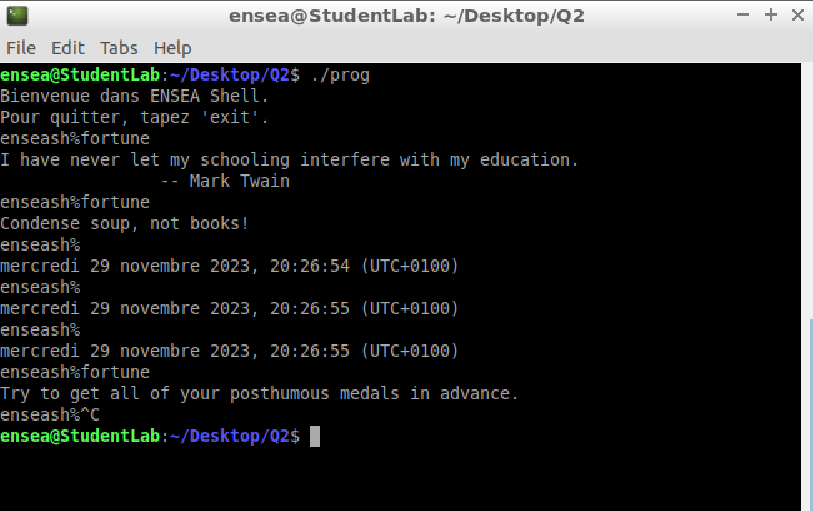
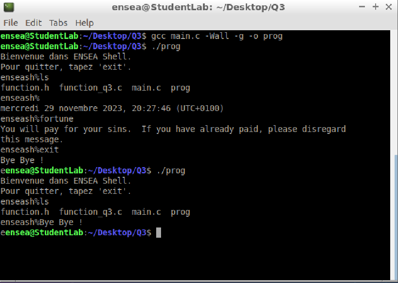

# Compte rendu, Lanfredi Camille, Weidle Rémi
2G2.TP1.1D1 | ENSEA 2023

## TP 1
### Question 1 : 

> Lors de cette première question on cherche à recréer un terminal. On affiche donc un message de bienvenue ainsi que le début  

>[!NOTE]
>Le début de l'interpreteur sera enseash%   
>De même il n'est pas possible de quitter autre que Ctrl+C cr nous n'avons pas configuré le exit (Q3)  

### Question 2 : 

> Cette fois ci on cherche soit à afficher la date ou alors executer la commande. Pour ce faire nous excluons le cas ou aucune commande est envoyé,     Puis si une commande est utilisé nous l'éxécutons puis nous revenons au 'terminal'. 

>[!TIP]
>Comme nous utilisons execlp nous devons faire un fork afin que lorsque le fils a finit d'éxécuter on ne sorte pas du 'shell' reproduit. Le processus père est donc en attente de son fils avant de pouvoir continuer...  

>[!WARNING]
>Ici le exit ne fonctionne toujours pas on doit utiliser Ctrl+C  

### Question 3 : 

> Dans cette question ajoute seulement de quoi sortir de notre programme sans avoir à utiliser le Ctrl+C. On va donc tester si la commande rentrée est "exit". On souhaite donc le placer avant le fork histoire d'éviter à fork de facon inutile...  

>[!WARNING]
>Il faut faire attention car on le compare à "exit" qui est une chaine de charactères. Par conséquent si on le place avant   
>commande[input_length - 1] = '\0';   
>Le test sera inefficace car la comparaison avec la chaine de charactères sera toujours fausse car elle ne se finti aps par '/0'  

### Question 4 : 

> Afin d'ecrire l'exit status et le signal information on utilise ce qui est présent dans le cour avec WEXITSTATUS ainsi que WIFSIGNALED  

>[!CAUTION]
>Nous avons particulièrement testé pour les exit status mais en ce qui concerne du signal nous n'avons pas éssayé a ce stade si le coté signal amrche correctement.  

### Question 5 : 

>[!TIP]
> Pour réussir cette question on décide de mesurer le temps d'éxecution avec les portes :    
> clock_gettime(CLOCK_REALTIME, &timeStart);  
> clock_gettime(CLOCK_REALTIME, &timeStop);  
> Qui fonctionne a peu près comme des stamp en microP.   

> On place donc le début du timer avant le fork et la fin du timer lorsque le processus père a finit d'attendre le fils donc que celui-ci a finit de travailler. Comme cela on a le temps que tout marche correctement. On convertit le temps ensuite en ms pour cque cela soit plus aprlant qu'en ns. 

>[!NOTE]
>Après avoir testé la fonction la fonction ls dure 0ms (donc très peu)  
>Fortune avec peu de texte ~3ms  
>Fortune avec un gros texte ~15ms  

